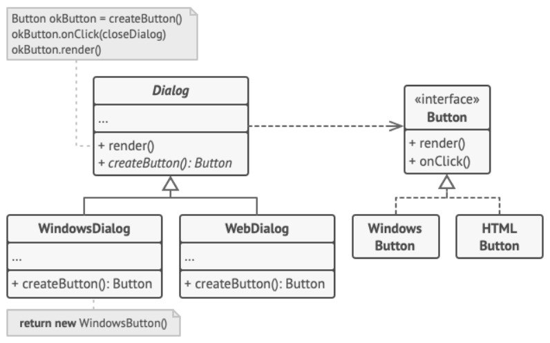

## Звіт про виконання практичної роботи №1
# "Породжувальні" паттерни.

### Мета роботи - освоїти роботу з декораторами в Python 3.
### Мета роботи - освоїти роботу з "ПОроджувальними" паттернами в Python 3.

### Завдання
1. Дати теоретичний опис "Породжувальних" паттернів.
2. Дати тереотичний опис вибранрго шаблону з групи паттернів.
3. Зображити UML-діаграму данного шаблону.

### Хід роботи

1. "Породжувальні" паттерни, також відомі як паттерни створення або Creational design patterns, представляють собою ключову групу паттернів проектування в об'єктно-орієнтованому програмуванні. Ці паттерни фокусуються на процесі створення об'єктів та спрощують його управління. Основна мета цих паттернів полягає у наданні ефективного та гнучкого механізму для створення нових об'єктів. Вони дозволяють уникнути прямого зв'язку між клієнтом та механізмами створення об'єктів, а також надають можливість конфігурувати параметри створюваних об'єктів.
Основні "породжувальні" паттерни включають:
•  Фабричний метод (Factory Method): Цей паттерн надає загальний інтерфейс для створення об'єктів, дозволяючи підкласам змінювати тип створюваних об'єктів.
•  Абстрактна фабрика (Abstract Factory): Цей паттерн надає інтерфейс для створення сімейств взаємопов'язаних або взаємозалежних об'єктів без деталей їхньої конкретної реалізації.
•  Будівельник (Builder): Цей паттерн дозволяє конструювати складні об'єкти, розбиваючи процес створення на окремі кроки та дозволяючи конкретним реалізаціям змінювати порядок та деталі кожного кроку.
•  Прототип (Prototype): Цей паттерн дозволяє створювати новий об'єкт, скопіювавши властивості та стан існуючого об'єкта, що виступає прототипом.
•  Одинак (Singleton): Цей паттерн гарантує, що клас має тільки один екземпляр та надає глобальну точку доступу до цього екземпляра.
Ці паттерни надають можливість ефективно управляти процесом створення об'єктів, дозволяючи програмі бути більш гнучкою та готовою до змін.

2. Паттерн "Фабричний метод" (Factory Method) є одним з породжувальних паттернів проектування, який входить до групи "Породжувальні" паттерни. Цей паттерн дозволяє визначити загальний інтерфейс для створення об'єктів, але залишити сам процес створення цих об'єктів на підкласах, забезпечуючи можливість змінювати тип створюваних об'єктів.
Основна мета паттерна "Фабричний метод" - забезпечити можливість створення об'єктів з використанням загального інтерфейсу, визначеного в абстрактному класі, при цьому конкретна реалізація створення об'єкта знаходиться в підкласах.
Ключові складові паттерна "Фабричний метод":
•  Creator (Творець): Це абстрактний клас або інтерфейс, який визначає метод "фабричний метод", що використовується для створення об'єктів. Він може містити інші методи для роботи з цими об'єктами, що повинні бути реалізовані у конкретних підкласах.
•  ConcreteCreator (Конкретний творець): Це конкретний підклас або клас, який успадковується від "Творця" і реалізує фабричний метод, щоб створювати конкретні об'єкти.
•  Product (Продукт): Це абстрактний клас або інтерфейс, який визначає специфікацію для об'єктів, які будуть створені фабричним методом.
•  ConcreteProduct (Конкретний продукт): Це конкретний клас або класи, які успадковуються від "Продукту" і реалізують його методи.
Паттерн "Фабричний метод" дозволяє розділити створення об'єктів від їх використання, забезпечуючи гнучкість та розширюваність програми. Кожен конкретний творець визначає специфіку створення свого конкретного продукту, забезпечуючи можливість вибору типу об'єкта відповідно до конкретних потреб програми.

3. 
4.Створюємо [програму](Program.py), щоб наприкладі показати роботу паттерна "Фабричний метод"
### Висновок
Паттерн "Фабричний метод" є одним із породжувальних паттернів проектування, спрямованим на створення об'єктів в програмі. Цей паттерн дозволяє визначити загальний інтерфейс для створення об'єктів, але покладає процес створення конкретних об'єктів на підкласи. Це дозволяє гнучко змінювати типи створюваних об'єктів, що робить код більш масштабованим і легше піддається змінам у майбутньому. Паттерн "Фабричний метод" допомагає вдосконалити структуру програми і зробити її більш розширюваною та підтримуваною.