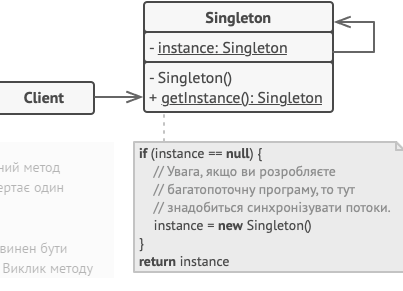

## Звіт про виконання практичної роботи №1
# "Породжувальні" паттерни.

### Мета роботи - освоїти роботу з декораторами в Python 3.
### Мета роботи - освоїти роботу з "ПОроджувальними" паттернами в Python 3.

### Завдання
1. Дати теоретичний опис "Породжувальних" паттернів.
2. Дати тереотичний опис вибранрго шаблону з групи паттернів.
3. Зображити UML-діаграму данного шаблону.

### Хід роботи
1. "Породжувальні" паттерни, або паттерни створення (Creational design patterns), входять до числа основних паттернів проектування в об'єктно-орієнтованому програмуванні. Ці паттерни зосереджені на створенні об'єктів та керуванні процесом їх створення. Головна мета цих паттернів полягає в наданні ефективного та гнучкого механізму створення нових об'єктів, уникненні прямого зв'язку між клієнтом та створенням об'єктів, а також у можливості конфігурування створюваних об'єктів.
Основні "породжувальні" паттерни включають:
• Фабричний метод (Factory Method): Цей паттерн надає загальний інтерфейс для створення об'єктів, дозволяючи підкласам змінювати тип створюваних об'єктів.
• Абстрактна фабрика (Abstract Factory): Цей паттерн надає інтерфейс для створення сімейств взаємопов'язаних або взаємозалежних об'єктів без деталей їхньої конкретної реалізації.
• Будівельник (Builder): Цей паттерн дозволяє конструювати складні об'єкти, розбиваючи процес створення на окремі кроки та дозволяючи конкретним реалізаціям змінювати порядок та деталі кожного кроку.
• Прототип (Prototype): Цей паттерн дозволяє створювати новий об'єкт, скопіювавши властивості та стан існуючого об'єкта, що виступає прототипом.
• Одинак (Singleton): Цей паттерн гарантує, що клас має тільки один екземпляр та надає глобальну точку доступу до цього екземпляра.
Ці паттерни надають можливість ефективно управляти процесом створення об'єктів, дозволяючи програмі бути більш гнучкою та готовою до змін.
2. Паттерн Прототип (Prototype) є одним з породжувальних паттернів проектування в об'єктно-орієнтованому програмуванні. Цей паттерн використовується для створення нових об'єктів, копіюючи властивості та стан існуючого об'єкта, який виступає прототипом.
Основна мета паттерна Прототип полягає у тому, щоб уникнути зайвого операційного навантаження при створенні нових об'єктів шляхом копіювання вже існуючих об'єктів (прототипів), замість створення об'єктів з нуля. Це може бути особливо ефективним у випадках, коли створення об'єкта є складним або дорогим процесом.
Основні складові паттерна Прототип:
• Прототип (Prototype): Це інтерфейс або абстрактний клас, який визначає метод для клонування об'єкта. Об'єкти, які хочуть підтримувати клонування, повинні реалізувати цей інтерфейс або успадковувати цей клас.
• Конкретний прототип (Concrete Prototype): Це конкретна реалізація інтерфейсу прототипу, яка реалізує метод клонування. Цей клас визначає, яким чином об'єкт може бути клонований.
У паттерні Прототип використовуються два основних способи клонування: поверхневе копіювання (shallow copy) та глибоке копіювання (deep copy). Поверхневе копіювання копіює лише посилання на об'єкти, тоді як глибоке копіювання створює нові об'єкти та копіює значення всіх внутрішніх об'єктів.
Паттерн Прототип дозволяє створювати об'єкти на основі існуючих, забезпечуючи швидке та ефективне створення нових об'єктів за допомогою клонування.        
3.         
4. Створюємо [програму](lab1.py), щоб наприкладі показати роботу паттерна "Одинак"
### Висновок
Ми освоїли роботу з паттерном "Одинак", який належить до групи "Породжувальні" паттерни проектування.
