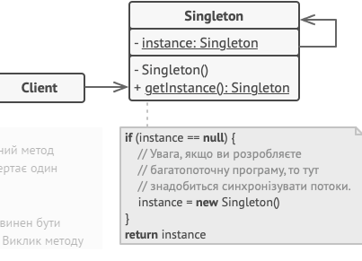

## Звіт про виконання практичної роботи №1
# "Породжувальні" паттерни.

### Мета роботи - освоїти роботу з декораторами в Python 3.
### Мета роботи - освоїти роботу з "Породжувальними" паттернами в Python 3.

### Завдання
1. Дати теоретичний опис "Породжувальних" паттернів.
2. Дати тереотичний опис вибранрго шаблону з групи паттернів.
3. Зображити UML-діаграму данного шаблону.

### Хід роботи
1. "Породжувальні" паттерни, або паттерни створення (Creational design patterns), входять до числа основних паттернів проектування в об'єктно-орієнтованому програмуванні. Ці паттерни зосереджені на створенні об'єктів та керуванні процесом їх створення. Головна мета цих паттернів полягає в наданні ефективного та гнучкого механізму створення нових об'єктів, уникненні прямого зв'язку між клієнтом та створенням об'єктів, а також у можливості конфігурування створюваних об'єктів.
Основні "породжувальні" паттерни включають:
• Фабричний метод (Factory Method): Цей паттерн надає загальний інтерфейс для створення об'єктів, дозволяючи підкласам змінювати тип створюваних об'єктів.
• Абстрактна фабрика (Abstract Factory): Цей паттерн надає інтерфейс для створення сімейств взаємопов'язаних або взаємозалежних об'єктів без деталей їхньої конкретної реалізації.
• Будівельник (Builder): Цей паттерн дозволяє конструювати складні об'єкти, розбиваючи процес створення на окремі кроки та дозволяючи конкретним реалізаціям змінювати порядок та деталі кожного кроку.
• Прототип (Prototype): Цей паттерн дозволяє створювати новий об'єкт, скопіювавши властивості та стан існуючого об'єкта, що виступає прототипом.
• Одинак (Singleton): Цей паттерн гарантує, що клас має тільки один екземпляр та надає глобальну точку доступу до цього екземпляра.
Ці паттерни надають можливість ефективно управляти процесом створення об'єктів, дозволяючи програмі бути більш гнучкою та готовою до змін.
2. Шаблон Singleton є одним із шаблонів проектування, що входить до категорії структурних патернів. Його основна ідея полягає в тому, щоб гарантувати, що для певного класу існує лише один єдиний екземпляр, і надається глобальний спосіб доступу до цього екземпляра.

Основні характеристики та призначення паттерна Singleton:

Гарантія єдиного екземпляра: Singleton гарантує, що для класу буде створено лише один екземпляр і цей екземпляр буде доступний глобально.

Лінійний доступ: Цей шаблон надає глобальну точку доступу до єдиного екземпляра класу, що дозволяє звертатися до нього з будь-якого місця в програмі.

Ліниве створення: Єдиний екземпляр створюється лише при першому зверненні до нього, що зменшує споживання ресурсів.

Глобальний стан: Оскільки єдиний екземпляр доступний глобально, він може використовуватися для збереження глобального стану або ресурсів, таких як бази даних, файлові дескриптори і т. д.

Паттерн важко тестирувати: Використання Singleton може зробити код складним для тестування, оскільки глобальний стан може впливати на результати тестів.

Можливість розширення: Шаблон Singleton може бути розширений для створення пулу об'єктів або інших варіацій, що потребують гарантованого єдиного екземпляра.

Паттерн Singleton досить поширений у програмуванні, коли необхідно гарантувати, що певний клас має лише один екземпляр і цей екземпляр може бути легко доступний з різних частин програми.        
3.         
4. Створюємо [програму](lab1.py), щоб наприкладі показати роботу паттерна "Одинак"
### Висновок
Ми освоїли роботу з паттерном "Одинак", який належить до групи "Породжувальні" паттерни проектування.
