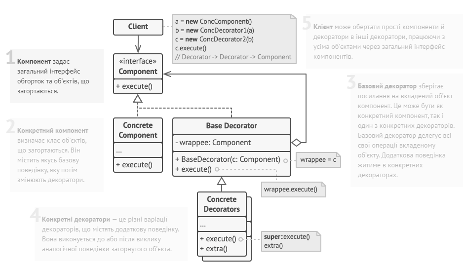

## Міністерство освіти на науки України
## Львівський Національний Університет Природокористування
### Факультет механіки та енергетики
### Кафедра Інформаційних систем та технологій

### Виконав: Назаркевич Юрій Андрійович
### Перевірив: Андрій Татомир Володимирович

## Звіт про виконання практичної роботи №2
# "Структурні" паттерни.

### Мета роботи - освоїти роботу з "Структурними" паттернами в Python 3.

### Завдання
1. Дати теоретичний опис "Структурних" паттернів.
2. Дати теоретичний опис вибраного шаблону з групи паттернів
3. Зображити UML-діграму даного шаблону.

### Хід роботи
1. Концепція "Структурні паттерни" (Structural Patterns) входить до однієї з чотирьох ключових груп паттернів проектування у сфері програмування. Ці паттерни спрямовані на те, щоб сприяти взаємодії між об'єктами та класами, формуючи більш складні структури та об'єктні системи.
Основні паттерни в групі "Структурні" включають наступне:
Адаптер (Adapter): Цей паттерн дозволяє об'єктам з різними інтерфейсами працювати разом, перетворюючи інтерфейс одного об'єкта в інший.
• Міст (Bridge): Міст розділяє абстракцію від реалізації, дозволяючи їм змінюватися незалежно. Цей паттерн використовується для забезпечення гнучкості та розширюваності системи.
• Склад (Composite): Паттерн "Склад" дозволяє об'єднувати об'єкти в деревоподібні структури для представлення складних ієрархій об'єктів.
• Декоратор (Decorator): Декоратор додає додаткову функціональність до об'єкта, не змінюючи його структури. Цей паттерн дозволяє динамічно надавати об'єктам нові можливості.
• Фасад (Facade): Фасад надає простий інтерфейс для складних систем або наборів об'єктів, спрощуючи їх використання та зменшуючи складність коду.
• Проксі (Proxy): Проксі дозволяє контролювати доступ до об'єкта, надаючи об'єкту-заміннику можливість виконувати додаткову логіку перед або після доступу до основного об'єкта.
• Компонувальник (Flyweight): Компонувальник допомагає оптимізувати використання пам'яті, дозволяючи багатьом об'єктам використовувати спільну частину стану.
Ця група паттернів спрямована на спрощення розширення та обслуговування програмного коду, розділення обов'язків між класами та об'єктами, а також на створення більш гнучких і розширюваних систем. Розробники можуть з легкістю та ефективністю створювати складні системи, дотримуючись принципів цих паттернів, що допомагає зберегти читабельність та гнучкість коду.

2.Шаблон декоратора (Decorator) є одним із структурних патернів проектування і використовується для динамічного додавання нового функціоналу або властивостей до існуючих об'єктів без зміни їхнього коду. Цей паттерн базується на композиції, де об'єкт обгортається іншим об'єктом (декоратором), який надає додаткову функціональність.

Основні характеристики та призначення паттерна Decorator:

Динамічне розширення функціональності: Паттерн Decorator дозволяє додавати функціональність до об'єкта динамічно, без потреби модифікувати його код.

Композиція об'єктів: Об'єкт-декоратор обгортає інший об'єкт, створюючи ланцюг декораторів. Цей ланцюг дозволяє додавати декілька різних функціональних обгорток.

Інтерфейс сумісності: Декоратори і обгорнуті об'єкти реалізують спільний інтерфейс, що дозволяє їм взаємодіяти без знання одне про одне.

Відкритий для розширення, закритий для модифікації (Open/Closed Principle): За допомогою паттерна Decorator можна розширювати функціональність об'єкта, не змінюючи його код.

Видалення функціональності: Декоратори також можуть бути використані для видалення певних функцій або властивостей об'єкта.

Легко підтримувати і тестувати код: Паттерн Decorator дозволяє створювати компоненти з різними комбінаціями функціональності та тестувати їх незалежно один від одного.

Паттерн Decorator дуже корисний, коли вам потрібно додати додаткові функції до об'єкта, але ви не хочете модифікувати його основний код або коли у вас є декілька можливих варіацій функціональності, які можуть бути додані до об'єкта.    
3.                
4. Створюємо [програму](lab2.py), щоб наприкладі продемонструвати роботу паттерна "Декоратор" 

### Висновок
Ми успішно освоїли принципи та використання структурного паттерну "Декоратор" (Decorator) та набули поглиблених знань щодо групи "Структурних" паттернів.