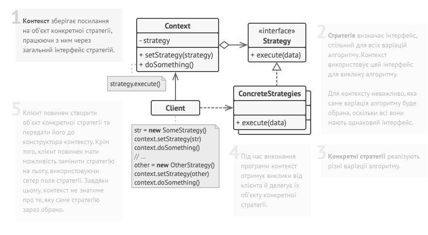

## Міністерство освіти на науки України
## Львівський Національний Університет Природокористування
### Факультет механіки та енергетики
### Кафедра Інформаційних систем та технологій

## Звіт про виконання практичної роботи №3
# "Поведінкові" паттерни.

### Мета роботи - освоїти роботу з "Поведінкові" паттернами в Python 3.

### Завдання
1. Дати теоретичний опис "Поведінкових" паттернів.
2. Дати теоретичний опис вибраного шаблону з групи паттернів
3. Зобразити UML-діаграму даного шаблону.

### Хід роботи
1. Група паттернів "Поведінкові" (Behavioral Patterns) представляє собою одну з ключових категорій паттернів проектування у програмуванні. Паттерни цієї групи зосереджені на організації взаємодії між об'єктами та класами з метою ефективної реалізації алгоритмів, керування потоками даних та управління програмою в цілому.
У цій групі виокремлено кілька основних паттернів, які дозволяють впоратися з важливими завданнями:
• Стратегія (Strategy): Цей паттерн дозволяє визначити сімейство алгоритмів, інкапсулювати кожен з них та зробити їх взаємозамінними. Клієнт може обирати, який алгоритм використовувати під час виконання програми.
• Спостерігач (Observer): Цей паттерн дозволяє одному об'єкту, який називається "суб'єктом", надсилати повідомлення про зміни свого стану до інших об'єктів, які називаються "спостерігачами". Цей механізм дозволяє реалізувати підписку та реакцію на події.
• Команда (Command): Паттерн "Команда" інкапсулює запити в об'єкти, що дозволяє параметризувати клієнтські об'єкти зі способами виклику запитів, чергової обробки та відміни операцій.
• Ланцюжок відповідальності (Chain of Responsibility): Цей паттерн дозволяє побудувати ланцюжок обробки запитів, де кожен обробник вирішує, чи може він обробити запит, і передає його іншому обробнику у ланцюжку, якщо не може.
• Стан (State): Паттерн "Стан" дозволяє об'єкту змінювати свою поведінку при зміні внутрішнього стану. Він інкапсулює різні стани об'єкта та дозволяє йому динамічно змінювати стан без зміни свого інтерфейсу.
• Відвідувач (Visitor): Цей паттерн визначає новий алгоритм, який можна застосовувати до об'єктів без зміни їхнього класу. Відвідувач дозволяє визначити зовнішню операцію, яка виконується на об'єктах, не змінюючи їх коду.
• Ітератор (Iterator): Паттерн "Ітератор" дозволяє об'єкту перебирати елементи складної колекції, не розкриваючи її структуру.
Ця група паттернів сприяє покращенню ефективності, читабельності та розширюваності коду, дозволяючи ефективно розподілити відповідальність між класами та об'єктами, які взаємодіють один з одним. Паттерни "Поведінкові" створюють шаблони взаємодії, які сприяють покращенню організації програмного забезпечення та надають йому гнучкість та розширюваність.

2. Шаблон Strategy - це поведнісний паттерн проектування, який дозволяє визначати набір алгоритмів, інкапсулювати кожен з них і робити їх взаємозамінними. Головна ідея полягає в тому, що ви можете вибирати алгоритм в режимі виконання без зміни структури коду.

Основні складові паттерну Strategy:

Контекст (Context): Клас, який містить посилання на об'єкт-стратегію і використовує його для виконання певного алгоритму.

Стратегія (Strategy): Абстрактний клас або інтерфейс, що визначає об'єкти-конкретні стратегії і має спільний метод, який реалізується конкретними стратегіями.

Конкретні стратегії (Concrete Strategies): Класи, які реалізують абстрактну стратегію і містять конкретний алгоритм.

Паттерн Strategy дозволяє замінювати алгоритми в рамках одного об'єкта-контексту без внесення змін у його структуру. Він допомагає уникнути гілок if-else, спрощує код, полегшує розширення і підтримує принцип "відкритий для розширення, закритий для модифікації" (Open/Closed Principle).

3. 
4. Створюємо [програму](lab3.py), щоб на прикладі продемонструвати роботу паттерна "Стратегія" 

### Висновок
Ми вивчили роботу з паттерном "Стратегія" та занурені глибше у групу паттернів, відомих як "Поведінкові".