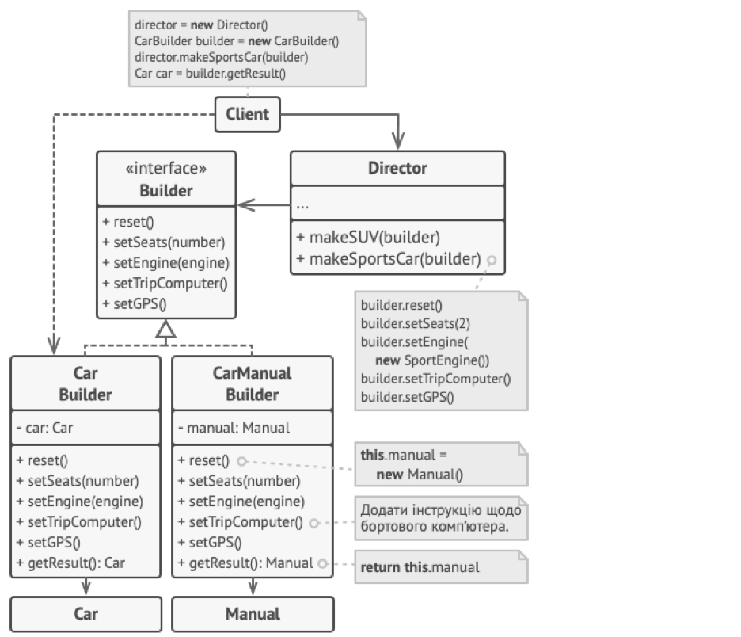

## Міністерство освіти на науки України
## Львівський Національний Університет Природокористування
### Факультет механіки та енергетики
### Кафедра Інформаційних систем та технологій

## Звіт про виконання практичної роботи №1
# "Породжувальні" паттерни.

### Мета роботи - освоїти роботу з "Породжувальними" паттернами в Python 3.

### Завдання
1. Дати теоретичний опис "Породжувальних" паттернів.
2. Дати теоретичний опис вибраного шаблону з групи паттернів
3. Зображити UML-діграму даного шаблону.

### Хід роботи
1. Група паттернів "Породжувальні" (Creational Patterns) - це одна з чотирьох основних груп паттернів проектування в області програмування. Ця група паттернів вирішує завдання створення об'єктів та управління процесом їх створення. Основна мета породжувальних паттернів - зробити створення об'єктів більш гнучким, ефективним та контрольованим. У цій групі є кілька основних породжувальних паттернів: •	Фабричний метод (Factory Method): Цей паттерн визначає інтерфейс для створення об'єкта, але залишає вибір конкретного класу нащадка на реалізацію цього інтерфейсу. Фабричний метод робить створення об'єктів більш гнучким і дозволяє підкласам визначати типи створюваних об'єктів. •	Абстрактна фабрика (Abstract Factory): Цей паттерн надає інтерфейс для створення сімейств пов'язаних об'єктів без заздалегідь визначеного класу конкретного об'єкта. Він дозволяє створювати об'єкти залежно від контексту та вимог, забезпечуючи сумісність між об'єктами. •	Одинак (Singleton): Цей паттерн гарантує, що в системі існує лише один екземпляр певного класу, і надає глобальний доступ до цього екземпляра. Він корисний, коли об'єкт має бути доступним у всій програмі та використовується для спільних ресурсів, таких як налаштування або з'єднання з базою даних. •	Будівельник (Builder): Цей паттерн розділяє процес створення складного об'єкта на кроки, дозволяючи збудувати різні конфігурації об'єкта, надаючи контроль над процесом створення та покращуючи читабельність коду. •	Прототип (Prototype): Цей паттерн дозволяє створювати нові об'єкти на основі існуючого об'єкта-прототипу, забезпечуючи швидке та ефективне створення об'єктів зі схожими характеристиками. Група паттернів "Породжувальні" допомагає розробникам зберігати створені об'єкти відповідним чином, контролювати процес їх створення та забезпечувати гнучкість у виборі типу об'єкта. Це сприяє поліпшенню якості і підтримуваності програмного забезпечення.
2. Паттерн "Будівельник" (англ. Builder Pattern) - це структурний паттерн проектування, який використовується для конструювання складних об'єктів шляхом крокового створення їх складових частин. Він розділяє процес побудови об'єкта від його представлення, дозволяючи одному і тому ж побудованому процесу створювати різні представлення об'єкта. Основні учасники паттерна "Будівельник" включають: 1.	Будівельник (Builder): Цей інтерфейс визначає методи для створення різних частин складного об'єкта. Ці методи можуть включати додавання елементів, налаштування параметрів тощо. 2.	Конкретний будівельник (Concrete Builder): Кожен конкретний будівельник реалізує інтерфейс будівельника та надає конкретну реалізацію методів побудови об'єкта. Він відповідає за створення і налаштування всіх частин об'єкта. 3.	Директор (Director): Директор відповідає за взаємодію з будівельником та визначає порядок та послідовність дій при створенні об'єкта. Він може приймати різні конфігурації для побудови об'єкта. 4.	Продукт (Product): Продукт - це складний об'єкт, який ми хочемо створити. Він представляє собою результат побудови, який може мати різні представлення або структури, в залежності від конкретного будівельника та його конфігурації. Основна ідея паттерна "Будівельник" полягає в тому, що клієнтський код взаємодіє з директором, який в свою чергу взаємодіє з конкретним будівельником для створення об'єкта. Директор визначає послідовність дій, які повинні бути виконані для створення об'єкта, і викликає відповідні методи будівельника. Паттерн "Будівельник" корисний у випадках, коли об'єкт має складну структуру, і важко створити його безпосередньо. Він дозволяє покроково налаштовувати об'єкт, додавати або вилучати його частини, і при цьому забезпечує вищу рівень контролю та гнучкість при створенні об'єкта.
3. 
4. Створюємо [простеньку програму](./main.py), щоб наприкладі продемонструвати роботу паттерна "Будівельник" 

### Висновок
Ми засвоїли роботу з паттерном "Будівельник". Більше дізнались про групу паттернів таких як "Породжувальні"