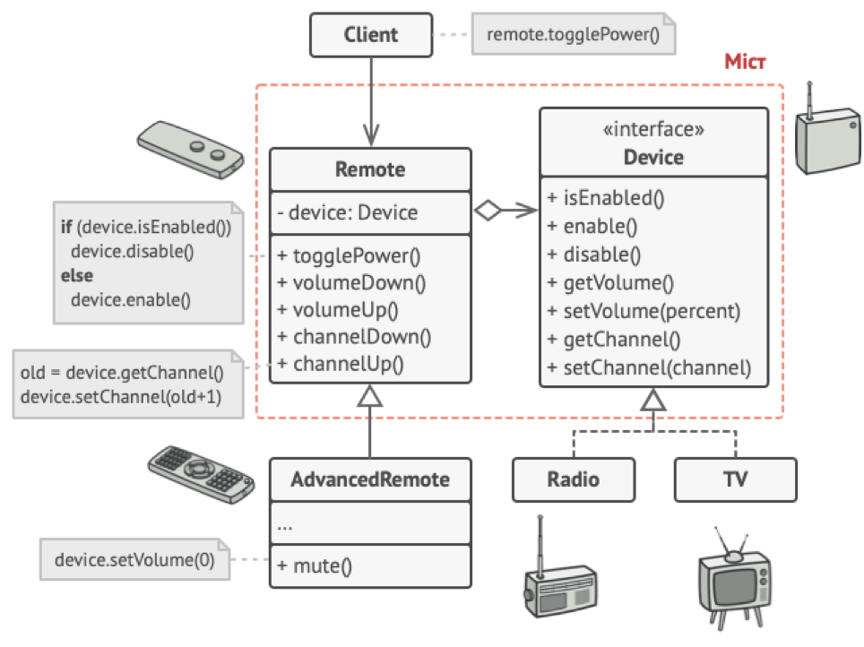

## Міністерство освіти на науки України
## Львівський Національний Університет Природокористування
### Факультет механіки та енергетики
### Кафедра Інформаційних систем та технологій

## Звіт про виконання практичної роботи №1
# "Структурні" паттернів.

### Мета роботи - освоїти роботу з "Структурні" паттернами в Python 3.

### Завдання
1. Дати теоретичний опис "Структурних" паттернів.
2. Дати теоретичний опис вибраного шаблону з групи паттернів
3. Зображити UML-діграму даного шаблону.

### Хід роботи
1. Група паттернів "Структурні" (Structural Patterns) - це одна з чотирьох основних груп паттернів проектування в області програмного проектування. Ця група паттернів спрямована на створення взаємодії між об'єктами та класами для формування більш складних структур та об'єктних систем.
Основні паттерни в групі "Структурні" включають такі:
    -	Адаптер (Adapter): Цей паттерн дозволяє об'єктам з різними інтерфейсами працювати разом, перетворюючи інтерфейс одного об'єкта в інший.
    -	Міст (Bridge): Міст розділяє абстракцію від реалізації, дозволяючи їм змінюватися незалежно. Цей паттерн використовується для забезпечення гнучкості та розширюваності системи.
    -	Склад (Composite): Паттерн "Склад" дозволяє об'єднувати об'єкти в деревоподібні структури для представлення складних ієрархій об'єктів.
    -	Декоратор (Decorator): Декоратор додає додаткову функціональність до об'єкта, не змінюючи його структури. Цей паттерн дозволяє динамічно надавати об'єктам нові можливості.
    -	Фасад (Facade): Фасад надає простий інтерфейс для складних систем або наборів об'єктів, що допомагає спростити їх використання та зменшити складність коду.
    -	Проксі (Proxy): Проксі дозволяє контролювати доступ до об'єкта, надаючи об'єкту-заміннику можливість виконувати додаткову логіку перед або після доступу до основного об'єкта.
    -	Компонувальник (Flyweight): Компонувальник допомагає оптимізувати використання пам'яті, дозволяючи багатьом об'єктам використовувати спільну частину стану.
Ця група паттернів спрямована на полегшення розширення та обслуговування програмного коду, розділення обов'язків між класами та об'єктами, а також на створення більш гнучких і розширюваних систем. Вона дозволяє розробникам створювати складні системи злегкістю та ефективністю, допомагаючи зберегти читабельність та гнучкість коду.

2. Паттерн "Міст" (Bridge) - це структурний паттерн проектування, який дозволяє розділити абстракцію від реалізації, дозволяючи їм змінюватися незалежно. Головна мета паттерна "Міст" - забезпечити гнучкість і розширюваність системи, розділивши класи на два окремі ієрархічні рівні: абстракцію та реалізацію.
Основні учасники паттерна "Міст" включають такі елементи:
    -	Абстракція (Abstraction): Це високорівневий компонент, який взаємодіє з клієнтами та включає в себе посилання на об'єкт типу "Реалізація". Абстракція визначає інтерфейс або абстрактний клас, який використовується для взаємодії з клієнтами.
    -	Реалізація (Implementation): Це низькорівневий компонент, який визначає конкретну реалізацію операцій, які викликаються абстракцією. Реалізація має власний інтерфейс, відокремлений від абстракції.
    -	Клієнт (Client): Клієнт - це об'єкт, який використовує абстракцію для виконання своїх завдань. Клієнт взаємодіє лише з абстракцією, і він не повинен знаходити жодних деталей реалізації.
Основна ідея паттерна "Міст" полягає в тому, що він дозволяє змінювати абстракцію та реалізацію незалежно один від одного. Це дає можливість мати різні варіанти абстракції і реалізації, і легко комбінувати їх, щоб отримати різні функціональні можливості. Паттерн "Міст" особливо корисний в тих випадках, коли ієрархія класів може зростати у двох незалежних напрямках.
Основні переваги паттерна "Міст" включають гнучкість, підтримку великої кількості варіантів і розширюваність системи. Він допомагає зберегти код чистим і організованим, спрощуючи впровадження змін та розширення функціоналу.

3. 
4. Створюємо [простеньку програму](./main.py), щоб наприкладі продемонструвати роботу паттерна "Міст" 

### Висновок
Ми засвоїли роботу з паттерном "Міст". Більше дізнались про групу паттернів таких як "Структурні"