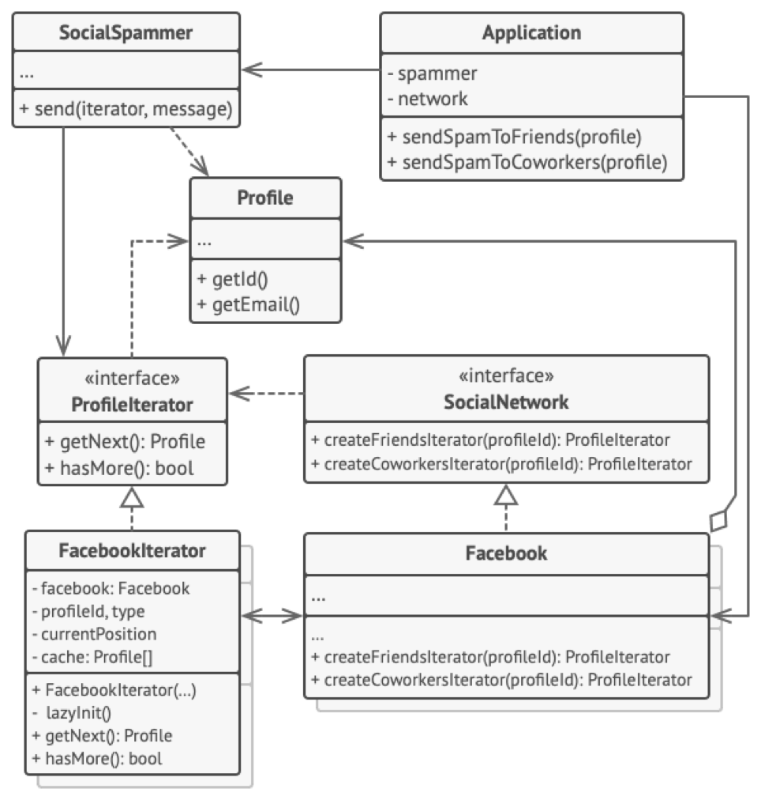

## Міністерство освіти на науки України
## Львівський Національний Університет Природокористування
### Факультет механіки та енергетики
### Кафедра Інформаційних систем та технологій

## Звіт про виконання практичної роботи №3
# "Породжувальні" паттерни.

### Мета роботи - освоїти роботу з "Породжувальними" паттернами в Python 3.

### Завдання
1. Дати теоретичний опис "Породжувальним" паттернів.
2. Дати теоретичний опис вибраного шаблону з групи паттернів
3. Зображити UML-діграму даного шаблону.

### Хід роботи
1. Група паттернів "Поведінкові" (Behavioral Patterns) - це одна з чотирьох основних груп паттернів проектування в області програмного проектування. Паттерни цієї групи спрямовані на організацію взаємодії між об'єктами та класами для ефективної реалізації алгоритмів та управління потоками даних та керуванням програмою в цілому.
Основні паттерни в групі "Поведінкові" включають такі:
    -	Стратегія (Strategy): Цей паттерн дозволяє визначити сімейство алгоритмів, інкапсулювати кожен з них і зробити їх взаємозамінними. Клієнт може обирати, який алгоритм використовувати під час виконання програми.
    -	Спостерігач (Observer): Спостерігач дозволяє одному об'єкту, який називається "суб'єктом", надсилати повідомлення про зміни свого стану до інших об'єктів, які називаються "спостерігачами". Цей паттерн використовується для реалізації механізму підписки та реакції на події.
    -	Команда (Command): Паттерн "Команда" інкапсулює запити в об'єкти, що дозволяє параметризувати клієнтські об'єкти зі способами виклику запитів, чергової обробки та відміни операцій.
    -	Ланцюжок відповідальності (Chain of Responsibility): Цей паттерн дозволяє побудувати ланцюжок обробки запитів, де кожен обробник вирішує, чи може він обробити запит, і передає його іншому обробнику в ланцюжку, якщо не може.
    -	Стан (State): Паттерн "Стан" дозволяє об'єкту змінювати свою поведінку при зміні внутрішнього стану. Він інкапсулює різні стани об'єкта та дозволяє йому динамічно змінювати стан без зміни свого інтерфейсу.
    -	Відвідувач (Visitor): Цей паттерн визначає новий алгоритм, який можна застосовувати до об'єктів без зміни їхнього класу. Відвідувач дозволяє визначити зовнішню операцію, яка виконується на об'єктах, не змінюючи їх коду.
    -	Ітератор (Iterator): Паттерн "Ітератор" дозволяє об'єкту перебирати елементи складної колекції, не розкриваючи її структуру.
Ця група паттернів допомагає розробникам підвищити ефективність, читабельність і розширюваність коду, розділивши відповідальність між класами та об'єктами, які взаємодіють один з одним. Паттерни "Поведінкові" створюють шаблони взаємодії, які допомагають покращити організацію програмного забезпечення та забезпечити його гнучкість і розширюваність.

2. Паттерн "Ітератор" (Iterator) - це поведінковий паттерн проектування, який використовується для обходу і отримання доступу до елементів складних об'єктів, таких як списки, колекції або структури даних, без розкриття їхньої внутрішньої реалізації. Ітератор дозволяє ізолювати спосіб, яким об'єкти ітеруються, від клієнта, що спрощує роботу з об'єктами, які мають велику кількість елементів.
Основні учасники паттерна "Ітератор" включають такі елементи:
-	Інтерфейс ітератора (Iterator Interface): Цей інтерфейс визначає методи для навігації по елементах колекції, такі як переміщення до наступного елемента, перевірка наявності наступного елемента та отримання поточного елемента.
-	Конкретний ітератор (Concrete Iterator): Клас конкретного ітератора реалізує інтерфейс ітератора і надає конкретну реалізацію для навігації по колекції.
-	Абстракція (Aggregate): Це інтерфейс або абстрактний клас, який оголошує метод для створення ітератора. Цей інтерфейс також може включати методи для доступу до елементів колекції.
-	Конкретна абстракція (Concrete Aggregate): Клас конкретної абстракції реалізує інтерфейс абстракції і надає конкретну реалізацію для створення ітератора, який може перебирати елементи колекції.
Паттерн "Ітератор" дозволяє розробникам створювати ітератори для різних видів колекцій і об'єктів, не залежно від їхньої реалізації. Це спрощує взаємодію зі складними структурами даних та полегшує процес обходу елементів колекцій. Паттерн "Ітератор" важливий для підтримки принципу "відкритості-закритості" (Open-Closed Principle) і допомагає забезпечити зручний і безпечний доступ до даних в програмі.
3. 
4. Створюємо [простеньку програму](./main.py), щоб наприкладі продемонструвати роботу паттерна "Ітератор" 

### Висновок
Ми засвоїли роботу з паттерном "Ітератор". Більше дізнались про групу паттернів таких як "Породжувальні"