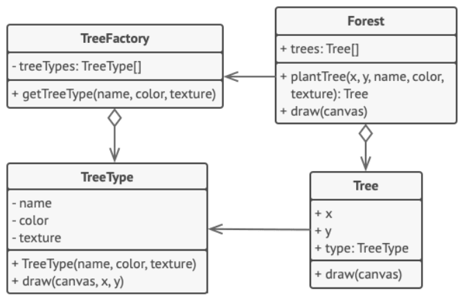

## Міністерство освіти на науки України
## Львівський Національний Університет Природокористування
### Факультет механіки та енергетики
### Кафедра Інформаційних систем та технологій

### Виконав: Кучкуда Максим Ігорович
### Перевірив: Андрій Татомир Володимирович

## Звіт про виконання практичної роботи №2
# "Структурні" паттернів.

### Мета роботи - освоїти роботу з "Структурні" паттернами в Python 3.

### Завдання
1. Дати теоретичний опис "Структурних" паттернів.
2. Дати теоретичний опис вибраного шаблону з групи паттернів
3. Зображити UML-діграму даного шаблону.

### Хід роботи
1. Концепція "Структурні паттерни" (Structural Patterns) входить до однієї з чотирьох ключових груп паттернів проектування у сфері програмування. Ці паттерни спрямовані на те, щоб сприяти взаємодії між об'єктами та класами, формуючи більш складні структури та об'єктні системи.
Основні паттерни в групі "Структурні" включають наступне:
Адаптер (Adapter): Цей паттерн дозволяє об'єктам з різними інтерфейсами працювати разом, перетворюючи інтерфейс одного об'єкта в інший.
• Міст (Bridge): Міст розділяє абстракцію від реалізації, дозволяючи їм змінюватися незалежно. Цей паттерн використовується для забезпечення гнучкості та розширюваності системи.
• Склад (Composite): Паттерн "Склад" дозволяє об'єднувати об'єкти в деревоподібні структури для представлення складних ієрархій об'єктів.
• Декоратор (Decorator): Декоратор додає додаткову функціональність до об'єкта, не змінюючи його структури. Цей паттерн дозволяє динамічно надавати об'єктам нові можливості.
• Фасад (Facade): Фасад надає простий інтерфейс для складних систем або наборів об'єктів, спрощуючи їх використання та зменшуючи складність коду.
• Проксі (Proxy): Проксі дозволяє контролювати доступ до об'єкта, надаючи об'єкту-заміннику можливість виконувати додаткову логіку перед або після доступу до основного об'єкта.
• Компонувальник (Flyweight): Компонувальник допомагає оптимізувати використання пам'яті, дозволяючи багатьом об'єктам використовувати спільну частину стану.
Ця група паттернів спрямована на спрощення розширення та обслуговування програмного коду, розділення обов'язків між класами та об'єктами, а також на створення більш гнучких і розширюваних систем. Розробники можуть з легкістю та ефективністю створювати складні системи, дотримуючись принципів цих паттернів, що допомагає зберегти читабельність та гнучкість коду.

2. Породжувальний паттерн "Легковик" (Builder) є одним із структурних паттернів проектування в області програмування. Цей паттерн використовується для конструювання об'єктів складної структури шляхом поетапної побудови.
Головна мета паттерну "Легковик" полягає у відокремленні процесу побудови складного об'єкта від його представлення. Це дозволяє побудувати об'єкт з однаковою структурою, але з різними деталями побудови, що відповідають різним сценаріям.
Основні учасники паттерну "Легковик" включають:
• Легковик (Builder): Це інтерфейс або абстрактний клас, який визначає методи для побудови різних частин об'єкта.
• Керівник (Director): Керівник визначає порядок кроків побудови об'єкта за допомогою Легковика.
• Конкретний легковик (Concrete Builder): Клас, який реалізує інтерфейс Легковика та забезпечує конкретні кроки для побудови об'єкта.
• Об'єкт, який будується (Product): Об'єкт, що побудований за допомогою паттерну "Легковик". Це є результатом побудови та містить додаткові властивості та методи.
Процес побудови може включати кроки, які специфікуються кожним конкретним легковиком. Керівник визначає правильний порядок викликів для конкретного легковика, а сам конкретний легковик реалізує кожен крок конструювання об'єкта.
Використання паттерну "Легковик" дозволяє створювати об'єкти зі складними структурами шляхом розділення конструювання об'єкта від його представлення. Це сприяє створенню більш гнучких та розширюваних систем.    
3.                
4. Створюємо [програму](2l.py), щоб наприкладі продемонструвати роботу паттерна "Легковик" 

### Висновок
Ми успішно освоїли принципи та використання породжувального паттерну "Легковик" (Builder) та набули поглиблених знань щодо групи паттернів "Структурні". Паттерн "Легковик" виявився потужним інструментом для послідовного конструювання складних об'єктів.