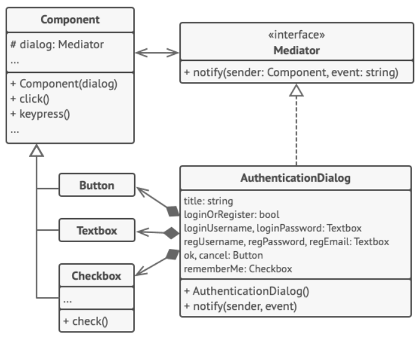

## Міністерство освіти на науки України
## Львівський Національний Університет Природокористування
### Факультет механіки та енергетики
### Кафедра Інформаційних систем та технологій

## Звіт про виконання практичної роботи №3
# "Поведінкові" паттерни.

### Мета роботи - освоїти роботу з "Поведінкові" паттернами в Python 3.

### Завдання
1. Дати теоретичний опис "Поведінкові" паттернів.
2. Дати теоретичний опис вибраного шаблону з групи паттернів
3. Зображити UML-діграму даного шаблону.

### Хід роботи
1. Група паттернів "Поведінкові" (Behavioral Patterns) представляє собою одну з ключових категорій паттернів проектування у програмуванні. Паттерни цієї групи зосереджені на організації взаємодії між об'єктами та класами з метою ефективної реалізації алгоритмів, керування потоками даних та управління програмою в цілому.
У цій групі виокремлено кілька основних паттернів, які дозволяють впоратися з важливими завданнями:
• Стратегія (Strategy): Цей паттерн дозволяє визначити сімейство алгоритмів, інкапсулювати кожен з них та зробити їх взаємозамінними. Клієнт може обирати, який алгоритм використовувати під час виконання програми.
• Спостерігач (Observer): Цей паттерн дозволяє одному об'єкту, який називається "суб'єктом", надсилати повідомлення про зміни свого стану до інших об'єктів, які називаються "спостерігачами". Цей механізм дозволяє реалізувати підписку та реакцію на події.
• Команда (Command): Паттерн "Команда" інкапсулює запити в об'єкти, що дозволяє параметризувати клієнтські об'єкти зі способами виклику запитів, чергової обробки та відміни операцій.
• Ланцюжок відповідальності (Chain of Responsibility): Цей паттерн дозволяє побудувати ланцюжок обробки запитів, де кожен обробник вирішує, чи може він обробити запит, і передає його іншому обробнику у ланцюжку, якщо не може.
• Стан (State): Паттерн "Стан" дозволяє об'єкту змінювати свою поведінку при зміні внутрішнього стану. Він інкапсулює різні стани об'єкта та дозволяє йому динамічно змінювати стан без зміни свого інтерфейсу.
• Відвідувач (Visitor): Цей паттерн визначає новий алгоритм, який можна застосовувати до об'єктів без зміни їхнього класу. Відвідувач дозволяє визначити зовнішню операцію, яка виконується на об'єктах, не змінюючи їх коду.
• Ітератор (Iterator): Паттерн "Ітератор" дозволяє об'єкту перебирати елементи складної колекції, не розкриваючи її структуру.
Ця група паттернів сприяє покращенню ефективності, читабельності та розширюваності коду, дозволяючи ефективно розподілити відповідальність між класами та об'єктами, які взаємодіють один з одним. Паттерни "Поведінкові" створюють шаблони взаємодії, які сприяють покращенню організації програмного забезпечення та надають йому гнучкість та розширюваність.

2. Поведінковий паттерн "Посередник" є одним із шаблонів проектування в області програмування, який входить до категорії "поведінкових" паттернів. Цей паттерн використовується для організації взаємодії між об'єктами шляхом введення посереднического об'єкта, який координує цю взаємодію.
У шаблоні "Посередник" є центральний об'єкт, який виступає посередником між іншими об'єктами в системі. Цей об'єкт дозволяє об'єктам спілкуватися між собою, не пов'язуючи їх напряму. Він принципово важливий для зменшення залежностей між класами та підвищення модульності системи.
Головна ідея полягає в тому, що об'єкти не взаємодіють безпосередньо один з одним, а звертаються до спеціального об'єкта-посередника, який керує та координує їхню взаємодію.
Основні складові:
• Посередник (Mediator): Це центральний об'єкт, який контролює та координує взаємодію між іншими об'єктами. Він знає про всі об'єкти та відповідає за передачу повідомлень між ними.
• Колеги (Colleagues): Це об'єкти, які спілкуються через посередника. Колеги не знають один про одного і не взаємодіють безпосередньо. Вони відправляють та приймають повідомлення через посередника.
Переваги:
• Зменшення залежностей: Зменшується кількість прямих залежностей між компонентами системи, що полегшує зміни та розширення.
• Централізоване керування: Посередник централізує керування взаємодією, спрощуючи координацію між об'єктами.
• Підвищення модульності: Розділення обов'язків між посередником та колегами сприяє підвищенню модульності системи.
Цей паттерн широко використовується у веб-програмуванні (наприклад, реалізація веб-серверів), графічних інтерфейсах користувача (GUI), системах розподіленого обчислення та інших областях, де важлива координація взаємодії об'єктів.

3. 
4. Створюємо [програму](3l.py), щоб наприкладі продемонструвати роботу паттерна "Посередник" 

### Висновок
Ми вивчили роботу з паттерном "Ітератор" та занурені глибше у групу паттернів, відомих як "Поведінкові".