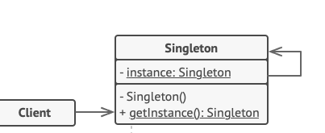

## Міністерство освіти та науки України
## Львівський національний університет природокористування
## Факультет механіки,енергетики та інформаційних технологій
## Кафедра інформаційних технологій    

## Звіт про викоання практичної роботи №1
## "Породжувальні" паттернів

## Виконала: Цап Марта 
## Перевірив: Татомир Андрій

### Мета роботи - освоіти роботу з декораторами в Python 3

### Завдання
1. Дати теоретичний опис "породжувальних" паттернів.
2. Дати теоретичний опис вибраного шаблону з групи паттернів.
3. Зображити UML-діаграму даного шаблону.

### Хід роботи
1. У розробці програмного забезпечення породжувальні шаблони — це шаблони проєктування, які стосуються механізмів створення об’єктів, намагаючись створити об’єкти відповідно до ситуації.
Основна форма створення об’єкта може спричинити проблеми з дизайном або додаткову складність дизайну. Творчі шаблони проєктування вирішують цю проблему, контролюючи створення цього об’єкта.
Породжувальні патерни вміщують в собі наступні 2 ідеї:
-Інкапсуляція знань про те, які конкретні класи використовує система
-Приховування функціоналу, а саме те, як створюються та комбінуються екземпляри цих конкретних класів
Якщо пояснювати більш простими словами, то вони розроблені для відокремлення системи від того, як її обʼєкти створені, складені та представлені. Тим самим породжувальні патерни збільшують гнучкість системи та допомогають відійти від успадкування класів до композиції обʼєктів.
Є 5 основних породжувальних патерна, а саме:
1.Фабричний метод (Factory method)
2.Абстрактна фабрика (Abstract Factory)
3.Будівельник (Builder)
4.Прототип (Prototype)
5.Одинак (Singleton)
Factory Method
Цей патерн визначає загальний інтерфейс для створення об’єктів у суперкласі, дозволяючи підкласам змінювати тип об’єктів, що створюються.
Фабричний метод допомогає уникати створення обʼєкту напряму. Ідея полягає в тому, що клас Creator або приймає клас, який треба буде створити, або приймає параметр, за яким самостійно визначить, який клас потрібен.
Клас Creator не завжди, але в більшості випадках, є абстрактним класом, який має абстрактний метод, в прикладі нижче це factoryMethod.
factoryMethod має повертати обʼєкт класу, який імплементує загальний інтерфейс (В прикладі: Product).
Таким чином в нас є класи, які успадковуються від Creator, та створюють обʼєкти конкретних класів продуктів.
Abstract Factory
Іноді фабричного методу не вистачає, наприклад, коли потрібно створити ціле сімейство обʼєктів.
В такому випадку краще застосовувати абстрактну фабрику. Вона допомагає створити цілі серії повʼязаних або залежних обʼєктів без вказівки їх конкретних класів. Зазвичай усі створені класи реалізують однаковий інтерфейс. Клієнта абстрактної фабрики не хвилює, як створюються ці об’єкти, він просто знає, як вони поєднуються.
Для правильної побудови абстрактної фабрики варто притримуватись наступних дій:
Створити таблицю/матрицю співвідношення типів продуктів до сімейств продуктів
Звести усі варіації продуктів до загальних інтерфейсів
Створити інтерфейс абстрактної фабрики. В ньому побудувати методи для створення кожного продукту
Створити класи фабрик, які будуть реалізовувати інтерфейс абстрактної фабрики, за принципом 1 фабрика = 1 клас
Builder
Даний шаблон допомогає уникнути класів з великою кількістю аргументів в середині конструктора.
Патерн проєктування Builder вирішує такі проблеми, як:
Як клас (той самий процес конструювання) може створювати різні представлення складного об’єкта
Як можна спростити клас, який включає створення складного об’єкта
Створення та збирання частин складного об’єкта безпосередньо в класі є негнучким. Це зобов’язує клас створити певне представлення складного об’єкта та унеможливлює зміну представлення пізніше незалежно від класу (без необхідності змінювати).
Шаблон проєктування Builder описує, як вирішити такі проблеми:
Інкапсулювання створення та збирання частин складного об’єкта в окремий об’єкт Builder
Клас делегує створення об’єкта об’єкту Builder замість того, щоб створювати об’єкти безпосередньо
Клас (той самий процес будівництва) може делегувати різні об’єкти Builder для створення різних представлень складного об’єкта
Подивіться, чи створення різних обʼєктів одного класу можливо звести до загальних кроків. Створіть на кожну реалізацію обʼєкту по класу-будівельнику, також подумайте, чи потрібно створювати директора, він не є обовʼязковим.
Prototype
Прототип дозволяє копіювати обʼєкти, не вдаючись у подробиці їх реалізації.
Шаблон вирішує такі проблеми, як:
Як об'єкти можуть створюватися у такий спосіб, щоб те, який об'єкт буде створено, визначалось під час виконання коду
Як можна створити екземпляри динамічно завантажених об'єктів
Створення об’єктів безпосередньо в класі, який потребує (використовує) об’єкти, є негнучким, оскільки воно прив’язує клас до певних об’єктів під час компіляції та робить неможливим вказати, які об’єкти створювати під час виконання.
Визначте об’єкт Prototype, який повертає свою копію
Створіть нові об’єкти, скопіювавши об’єкт Prototype
Це дає змогу конфігурувати клас з різними об’єктами Prototype, які копіюються для створення нових об’єктів, і навіть більше, об’єкти Prototype можна додавати та видаляти під час виконання.
Singleton
Варто зазначити, що Одинак вважається анти-патерном!
Цей патерн гарантує створення лише одного екземпляру класу та надає доступ до цього обʼєкту з будь-якої точки проєкту.
Складно описати діаграмою даний патерн, тому краще покажу у вигляді коду.
2. Одинак — це породжувальний патерн проектування, який гарантує, що клас має лише один екземпляр, та надає глобальну точку доступу до нього.
Одинак вирішує відразу дві проблеми (порушуючи принцип єдиного обов’язку класу):
Гарантує наявність єдиного екземпляра класу. Найчастіше за все це корисно для доступу до якогось спільного ресурсу, наприклад, бази даних.
Уявіть собі, що ви створили об’єкт, а через деякий час намагаєтесь створити ще один. У цьому випадку хотілося б отримати старий об’єкт замість створення нового.
Таку поведінку неможливо реалізувати за допомогою звичайного конструктора, оскільки конструктор класу завжди повертає новий об’єкт.
Надає глобальну точку доступу. Це не просто глобальна змінна, через яку можна дістатися до певного об’єкта. Глобальні змінні не захищені від запису, тому будь-який код може підмінити їхнє значення без вашого відома.
Проте, є ще одна особливість. Було б непогано й зберігати в одному місці код, який вирішує проблему №1, і мати до нього простий та доступний інтерфейс.
Цікаво, що в наш час патерн став настільки відомим, що тепер люди називають «одинаками» навіть ті класи, які вирішують лише одну з проблем, перерахованих вище.
3. 
4. Створюємо [програму](./lab.py), щоб показати роботу паттерна "Одинак"

### Висновок
Визначили, що таке паттерни. Засвоїли роботу з паттерном "Одинак".

