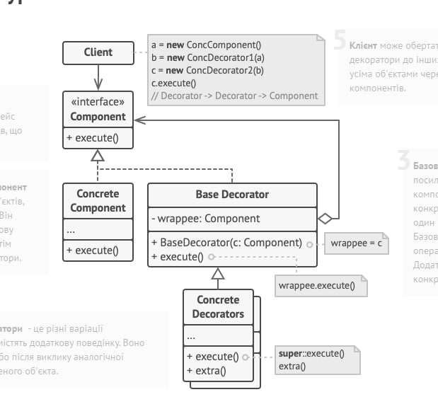

## Міністерство освіти та науки України
## Львівський національний університет природокористування
## Факультет механіки,енергетики та інформаційних технологій
## Кафедра інформаційних технологій    

## Звіт про викоання практичної роботи №2
## "Структурні" паттернів

## Виконала: Цап Марта 
## Перевірив: Татомир Андрій

### Мета роботи - освоіти роботу з декораторами в Python 3

### Завдання
1. Дати теоретичний опис "структурні" паттернів.
2. Дати теоретичний опис вибраного шаблону з групи паттернів.
3. Зображити UML-діаграму даного шаблону.

### Хід роботи
1. Структурні паттерни - це одна з категорій паттернів проектування в об'єктно-орієнтованому програмуванні, які стосуються організації класів і об'єктів для досягнення більшої гнучкості та ефективності програм. Ці паттерни використовуються для побудови складних структур програми, об'єднуючи класи та об'єкти в єдині системи, щоб спростити роботу з ними.
Декілька прикладів структурних паттернів включають:
Адаптер (Adapter): Цей паттерн дозволяє інтегрувати інтерфейс одного класу з іншим, непов'язаним інтерфейсом.
Міст (Bridge): Паттерн мост дозволяє відокремити абстракцію від реалізації, що дозволяє змінювати їх незалежно один від одного.
Компонувальник (Composite): Цей паттерн дозволяє створювати деревоподібні структури об'єктів, в яких індивідуальні об'єкти і їх композити (групи) можуть бути використані однаковим чином.
Декоратор (Decorator): Декоратор дозволяє додавати новий функціонал до існуючих об'єктів без зміни їхньої структури.
Проксі (Proxy): Паттерн проксі надає об'єкт, який виступає в якості замісника для іншого об'єкта, контролюючи доступ до нього.
Фасад (Facade): Фасад надає спрощений інтерфейс для взаємодії з складною системою, що допомагає приховати її складність.
2. Декоратор (Decorator) - це структурний паттерн проектування, який дозволяє динамічно додавати нові функціональність або змінювати поведінку існуючих об'єктів без необхідності змінювати їхні класи. Цей паттерн базується на принципі "вкладання", де об'єкти обгортки, або декоратори, накладаються на існуючі об'єкти, розширюючи їхню функціональність.
3. 
4. Створюємо [програму](./lab2.py), щоб показати роботу паттерна "Декоратор"

### Висновок
Паттерн "Декоратор" є потужним структурним паттерном проектування, який дозволяє динамічно додавати нову функціональність до об'єктів без потреби змінювати їхні класи. Використання декораторів дозволяє створювати композиції об'єктів з різними функціональними можливостями та надає більшу гнучкість та розширюваність коду.
У наведеному прикладі було створено клас `Coffee` як базовий компонент, який представляє базову каву з вартістю 5 одиниць. Далі були створені два декоратори: `MilkDecorator` і `SugarDecorator`. `MilkDecorator` додає молоко до кави, збільшуючи вартість на 2 одиниці, а `SugarDecorator` додає цукор, збільшуючи вартість на 1 одиницю.
Потім було продемонстровано, як можна створювати складні комбінації кави, додаючи декоратори до базового об'єкта `Coffee`. Наприклад, `coffee_with_milk_and_sugar` представляє каву з молоком і цукром.
Завдяки паттерну декоратор ми можемо легко додавати або видаляти функціональність, не модифікуючи основний клас `Coffee`. Це робить код більш підтримуваним і розширюваним, а також дозволяє створювати різноманітні комбінації функціональних можливостей для об'єктів.
