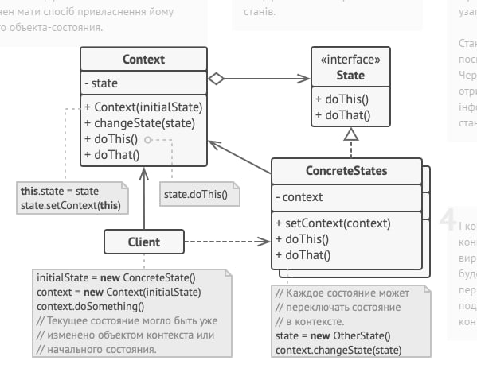

## Міністерство освіти та науки України
## Львівський національний університет природокористування
## Факультет механіки,енергетики та інформаційних технологій
## Кафедра інформаційних технологій    

## Звіт про викоання практичної роботи №3
## "Поведінкові" паттернів

## Виконала: Цап Марта 
## Перевірив: Татомир Андрій

### Мета роботи - освоіти роботу з декораторами в Python 3

### Завдання
1. Дати теоретичний опис "поведінкові" паттернів.
2. Дати теоретичний опис вибраного шаблону з групи паттернів.
3. Зображити UML-діаграму даного шаблону.

### Хід роботи
1."Поведінкові паттерни" - це одна з категорій паттернів проектування в об'єктно-орієнтованому програмуванні, які визначають способи організації спільної роботи об'єктів і взаємодії між ними. Ці паттерни допомагають контролювати потік виконання програми і полегшують спільну роботу об'єктів, роблячи її більш підтримуваною і розширюваною.
Деякі приклади популярних поведінкових паттернів включають:
Спостерігач (Observer): Дозволяє створити механізм підписки та сповіщення, щоб один об'єкт міг автоматично реагувати на зміни в іншому об'єкті.
Стан (State): Допомагає об'єктам змінювати свою поведінку в залежності від свого стану.
Стратегія (Strategy): Дозволяє об'єктам вибирати алгоритм виконання динамічно під час виконання програми.
Команда (Command): Інкапсулює запит як об'єкт, дозволяючи параметризувати клієнта запитами, ставити їх в чергу, або робити скасування та відміну.
Цепочка відповідальності (Chain of Responsibility): Дозволяє передавати запити послідовно через ланцюг обробників, до того моменту, коли один з обробників виконає запит.
Ітератор (Iterator): Надає спосіб послідовної ітерації по об'єктах без розкриття їхньої структури.
Спостерігач (Visitor): Дозволяє додавати нові операції до об'єктів без зміни їхньої структури.
2. Паттерн Стан (State) - це один із поведінкових паттернів проектування, який використовується для реалізації концепції кінцевого автомата. Він дозволяє об'єкту змінювати свою поведінку при зміні свого внутрішнього стану. Зазвичай використовується тоді, коли об'єкт має багато можливих станів та поведінки, яка залежить від поточного стану.
3. 
4. Створюємо [програму](./lab3.py), щоб показати роботу паттерна "Декоратор"

### Висновок
паттерн "Стан" допомагає керувати зміною поведінки об'єктів в залежності від їхнього стану. Він сприяє покращенню підтримки та розширюваності коду, спрощує розробку та підтримку системи та допомагає досягти більшої гнучкості та прозорості в програмуванні. У наданому коді ми реалізували паттерн "Стан" для керування станом та поведінкою пристрою для керування світлом. Висновок стосується цього конкретного коду:
Структура коду: Код включає класи State, OnState, OffState, EmergencyState, LightSwitch, які реалізують відповідні компоненти паттерну "Стан". Ця структура допомагає відокремити стани та логіку керування.
Динамічне переключення станів: У коді демонструється, як пристрій для керування світлом може динамічно змінювати свій стан та поведінку за допомогою методу switch.
Повідомлення і взаємодія зі станами: Кожен стан має власну реалізацію методу switch, який виводить повідомлення про зміну стану та залежно від поточного стану реагує відповідним чином.
Легкість розширення: Код легко розширюється додаванням нових станів та їхньої поведінки без необхідності зміни існуючого коду.
В цілому, наданий код ілюструє ефективне використання паттерну "Стан" для організації станів та поведінки об'єктів. Цей паттерн допомагає зменшити залежності між станами, полегшує підтримку та розширення системи та покращує її читабельність.

